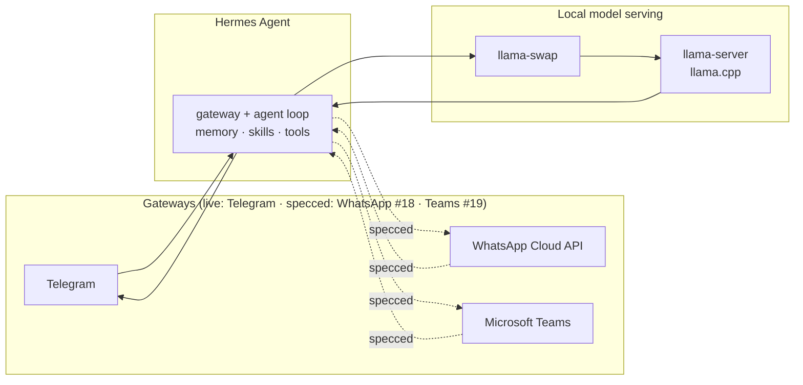
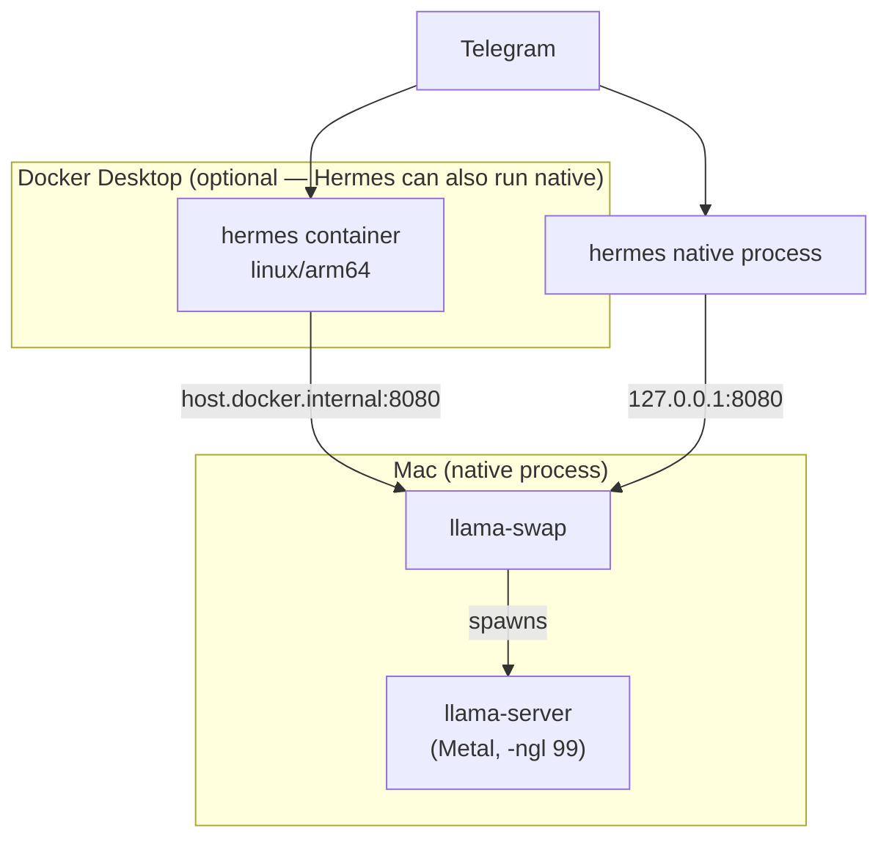
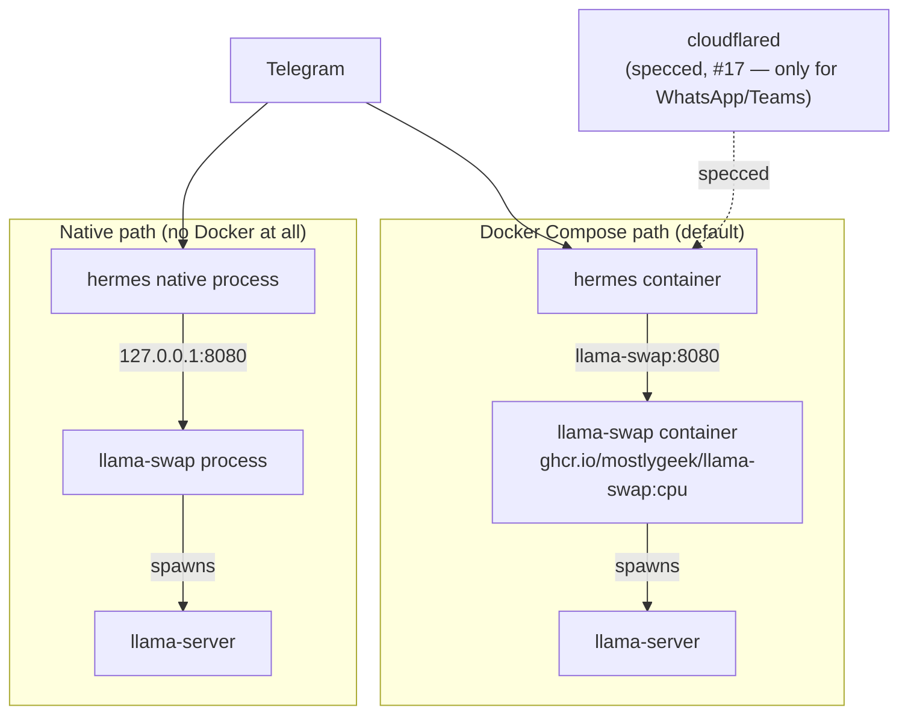
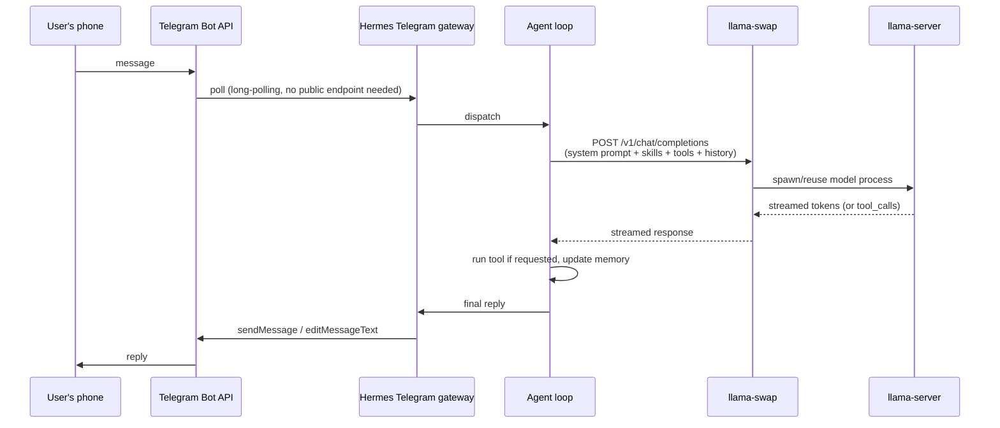
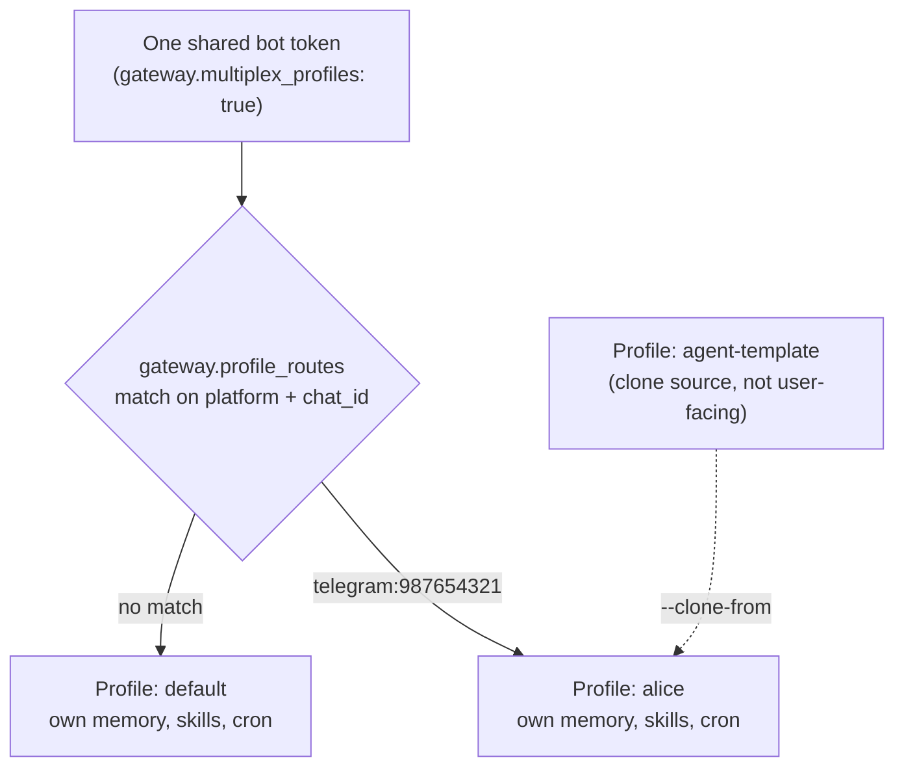

# Architecture

Living document — **update this file in the same change** whenever
something here stops being true (a new channel, a new data flow, a new
deployment path, a change to routing/isolation, a new major dependency).
See `CLAUDE.md`'s "Architecture document" rule. Each section below notes
whether it describes something **live** (implemented and, where noted,
verified against a real deployment) or **specced** (issues exist,
nothing built yet).

Last updated: 2026-09-03.

## 1. System overview

Three kinds of pieces, always the same shape regardless of platform:

- **Hermes Agent** ([github.com/NousResearch/hermes-agent](https://github.com/NousResearch/hermes-agent)) holds memory, skills, and tool access; it does not itself generate text.
- **llama-swap** ([mostlygeek/llama-swap](https://github.com/mostlygeek/llama-swap)) is a reverse proxy that loads/unloads `llama-server` processes on demand from `models.yaml`, enabling multiple models on one machine.
- **llama.cpp / llama-server** ([ggml-org/llama.cpp](https://github.com/ggml-org/llama.cpp)) actually runs inference. No external API key anywhere in this path — see `shared/enterprise-safety.md` for what that guarantee does and doesn't cover.

## 2. Deployment topologies (live)

Two independent platform configurations, each with a Docker path and a
fully-native (no-Docker) path. See `README.md`'s comparison table and
each platform's own README for exact commands.

### 2.1 macOS (Apple Silicon)

Metal acceleration requires `llama-server` to run natively — Docker
Desktop for Mac cannot expose the Metal GPU to a container, so
llama-swap/llama-server never run in Docker on this platform, regardless
of whether Hermes itself does.

### 2.2 Linux x86-64 VPS

No GPU assumed by default (`:cpu` image tag) — see `shared/prebuilt-binaries.md`
and issue #13 (specced) for GPU detection/support.

## 3. Message flow (Telegram — live, verified)

**Known hardware-dependent latency**: on a CPU-only VPS, the prefill step
(reading the ~15-40KB system prompt before the first token) can take
20-40+ minutes depending on real thread/memory-bandwidth availability —
see `shared/model-notes.md` and `shared/telegram-setup.md`. Mandatory
follow-up: issue #27 (benchmark real inference throughput during
provisioning, not just detect specs) — see memory note
`hermes_hardware_inference_verification`.

**WhatsApp/Teams (specced, #18/#19)** differ structurally: both are
webhook-delivered (Meta/Microsoft call this deployment over HTTPS),
requiring the Cloudflare Tunnel infrastructure in #17 — Telegram's
polling model needs none of that.

## 4. Multi-user profile isolation (partially live — #5)

**Live**: `linux-x86_64-vps/scripts/build-agent-template.sh` and
`provision-user.sh` exist and are verified to correctly manipulate
config/create profiles (tested with synthetic identifiers — see commit
history). **Not yet live** with a real second user, since the current
deployment only has one allowed Telegram user.

Isolation is structural (separate profile directories/state), not a
filter — see `shared/multi-user-agents.md` for the alternatives
considered and rejected (a shared-table filter, an in-chat admin/user
command split) and why.

## 5. Enterprise safety (live)

`approvals.mode: manual` is set in every config template in this repo —
every dangerous action always asks a human, no auto-approval regardless
of Hermes's own default `smart` mode. See `shared/enterprise-safety.md`
for exactly what this does and does not cover (notably: **no
delegated/group/SSO approval routing exists** — tracked as issue #4,
explicitly not assumed to work; and **`hermes -z`/`--oneshot` always
auto-bypasses every dangerous-command check, unconditionally, by
design** — confirmed live in issue #38, corrected in
`shared/enterprise-safety.md` 2026-09-03).

## 6. Specced, not yet implemented

Tracked in GitHub issues on `ka8t/Hermes` — do not treat any of this as
built until its issue is closed and this section is updated:

| Feature | Issues | Status |
|---|---|---|
| WhatsApp Cloud API / Microsoft Teams channels | #16-#20 | Config/docs/scripts implemented, not live-verified (needs the admin's own Meta/Microsoft accounts) |
| Hardware auto-detection (CPU/GPU) + mandatory inference benchmark | #11, #15 | CPU thread auto-detection live on both the Docker and native VPS paths (#12); GPU support for NVIDIA/AMD/Intel live on the VPS path (#13, not live-verified — no matching hardware); macOS thread count confirmed empirically not to matter with full Metal offload (#14); the mandatory real-throughput benchmark (#27) is live on both platforms, live-tested on both a CPU VPS and a real M1 Mac. Only #15 (hardware-sizing.md) remains partial, and only because it cross-links the above rather than needing new work itself |
| Enterprise RAG (Google Drive, Confluence, SharePoint) | #21-#26, #33 | Specced only, nothing built. Two-tier model: a global admin-curated corpus + a private per-user collection per Hermes profile (#5), each usable independently and a private collection able to also draw on the global corpus — modeled on a real prior implementation (`my-ia-v2`'s `Corpus`/`Collection` schema). Both tiers support web sources as well as documents. Model distillation was considered alongside this and explicitly rejected as out of scope — see #21 |
| Model/config evaluation harness | #28-#32 | Documented, not yet implemented — see `shared/model-evaluation.md`. BFCL for tool-calling reliability (confirmed to work against llama-swap directly via `--skip-server-setup`, no vLLM needed) and `llama-bench -o sql` for hardware/config throughput (its own SQL output already gives the "internal results database" #30 wants, no custom schema needed) — both verified against official docs. Model list is bounded to whatever BFCL already has a handler for. Continuous re-evaluation (#31) still unscoped |
| Instant message-received acknowledgment | #34 | A `pre_gateway_dispatch` hook sending an immediate ack independent of backend LLM speed, since Hermes's native `typing_indicator`/`long_running_notifications` can't show anything during pure prefill (no bytes come back from the model until the first token) |
| Global (cross-profile) stats/logs/KPI dashboard | #35 | Per-user stats already covered by #5's per-profile dashboards natively (usage/cost analytics, host stats, cron history already exist in Hermes's own dashboard); the gap is cross-profile aggregation for an admin view — that part is unbuilt |
| Deployment scripts ported from bash to Rust | #36 | Scope corrected during grilling: this repo's own scripts, not Hermes Agent itself (rejected, same reasoning as distillation in #21) — and explicitly not for speed (scripts are network/subprocess-bound, language-independent); real motivation is fragile JSON/YAML handling, cross-platform bash inconsistency, and single-binary distribution |
| In-channel multi-model comparison (`/compare`) | #39 | Documented, not yet implemented — see `shared/model-comparison.md`. A skill invoking `hermes -z --model <id>` per compared model (fresh context, real tools/skills) + `hermes send` to push results back progressively; parallel execution only when the admin has pre-configured a matching llama-swap `groups` entry, sequential otherwise. Mandatory technical safeguard: `terminal`/`code_execution`/`delegation` excluded from each sub-invocation's toolsets, since `hermes -z` unconditionally bypasses approvals (#38) |
| Agentic goal-drift root cause (PRIORITY) | #37 | Root-caused; two defense-in-depth mitigations now live: `agent.run_budget_seconds: 3600` in both platforms' `config.yaml.example`, and the exact failure prompt recorded on #29 as a required regression case. Neither is the fix — the durable fix is #28-#32's model evaluation, still unimplemented. Issue stays open until #29 exists and actually gates on this case |
| `single_query_mode` approval-bypass verification | #38 | **Resolved.** Confirmed live and against the installed CLI's own `--help` text: `hermes -z`/`--oneshot` always auto-bypasses every dangerous-command check by design ("approvals are auto-bypassed"), unrelated to `single_query_mode` (which only governs `hermes chat -q`). This repo's `shared/enterprise-safety.md` incorrectly conflated the two — corrected. Not an upstream bug; a documentation error in this repo |

## 7. Repository structure

See `README.md`'s "Repository structure" section for the file-level map;
this document is about behavior and data flow, that one is about where
things live on disk.

## Sources

Every architectural claim above traces to either this repo's own
verified testing (commit history, issue discussions) or the official
docs already cited throughout `shared/*.md` — this file summarizes and
diagrams, it does not introduce new unverified claims of its own.
